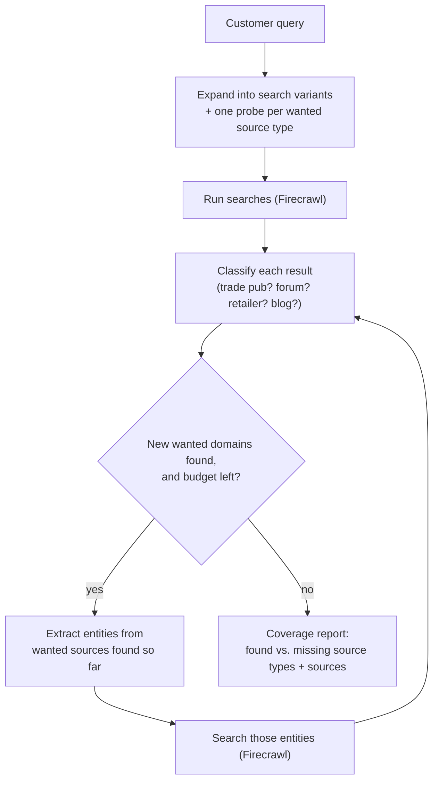

  

<h1 align="center">Ember</h1>

  <video src="media/ember-demo.mp4" controls width="720">
    Demo video: <a href="media/ember-demo.mp4">media/ember-demo.mp4</a>
  </video>

## What I built

This isn't an edge case: `vc_data/accounts.csv` shows this customer alone carries $180k ARR with a Q3 renewal and an explicit 2-team expansion riding on it, and `vc_data/tickets.csv` shows "search relevance / result count" is the third-largest support category in the last 90 days (38 tickets, behind only error confusion and scrape failures), so the same complaint is recurring across the customer base, not unique to one account.

The customer's complaint is specific: raising the search limit from ten to fifty just returned forty more of the same well-optimized sites. The trade publications, regional outlets, and enthusiast forums they need never show up, no matter how deep the same ranked list goes. Ember treats this as a discovery problem rather than a ranking problem. A single search only ever reads one slice of the web, and scrolling deeper into that slice never reaches into the slices it was never pointed at.

So Ember searches wider first, then keeps going. A topic gets expanded into a handful of differently framed queries, plus one extra search per source type the client actually wants, a forum-shaped search, a trade-press-shaped search, a regional-news-shaped search, each built from a fixed set of search operators rather than an operator the model invents on the fly. Everything that comes back gets classified into a source-type taxonomy (trade pub, regional press, forum, retailer, vendor blog, and so on), and only that classification decides what counts, never a heuristic.

There's another way to measure completeness: treat two search rounds as samples and use statistics to estimate how much of the source population is still unseen. That tells you how much might be missing. I chose a different measure: classify results by source type and keep going until no new wanted types show up. The customer named types, not a volume: trade pubs, regional press, niche forums. A missing-types list is something an analyst can act on right away. A coverage percentage just tells them to keep digging without saying where. Classifying what kind of source a page is is also something a language model already does well, so I didn't need new statistical methods to solve it.

The output is not a ranked list. It is a report: how many of each wanted source type were found, which ones came back empty (a real gap, not a low score), and the actual sources under each category for the analyst to read themselves. Depth is a dial, not a fixed setting. Four presets trade search and scrape budget for how many rounds the pipeline is willing to dig, from a quick single pass to an overnight-scale run that keeps going until the well runs dry.

The surface is a live search experience, not a chat and not a dashboard of past jobs. You type a topic, watch the pipeline actually work (which queries it ran, which entities it pulled out, which pages it read for deeper leads), and land on the gap report. Which source types count toward "found" is a picker in the composer, not a hardcoded rubric, since that is the client telling the product what they care about.

**Eval.** I built a small eval harness to test Ember's discovery step against two candidate replacements: a fixed no-LLM operator recipe, and the same idea with the operators LLM-written. Across repeated runs, the fixed recipe consistently surfaced more usable long-tail sources than Ember's current loop, and the LLM-written version did worse than both, since it over-constrains queries until almost nothing matches. Ember already borrows the fixed-template idea for its own category probes, but it's missing the one move that answers the customer's complaint most directly: excluding the SEO-winner domains it already found and searching again. That's the next thing to fold in. Full breakdown in `completeness-eval/`.

## What I deliberately didn't build, and why

**A chat interface.** The first version of the UI was a chat: ask anything, get an answer. But a chat that autonomously fields open-ended questions is exactly the shape of Firecrawl's own `/agent`. Ember's value isn't answering questions, it's auditing completeness, so I rebuilt the surface as single-shot search: type a topic, watch the deterministic pipeline run, read a source-type gap report. This also drew a clean line against agent mode: agent mode is an LLM deciding its own next action and handing back an answer, Ember is fixed code deciding every step and handing back a category-by-category breakdown of what's missing.

**Letting the model write its own search operators.** I tried having the model generate full search-operator queries (site:, intitle:, exclusions) for the category probes. Tested head to head against a fixed template where the model only supplies topic vocabulary and the operators stay hardcoded, and the model-authored version consistently over-constrained itself, piling on exclusions that ruled out the results it was trying to find. The fixed template found more. The model doesn't touch operator syntax now.

**Full-page extraction to score source quality.** After finding sources, the natural next step is ranking which ones are best. I could pull full page content through `/extract` and score relevance. Decided against it: the deliverable is a source list for an analyst who will read them anyway, not Ember's opinion on which one wins. Ordering by title and snippet relevance plus the classifier's confidence is free, since that data already exists. Paying for a full extract per source to produce a score nobody asked for is real credit cost for a feature the customer never requested.

## What the AI tools got wrong (and how I caught it)

The eval above depends entirely on one shared labeler that decides what counts as a long-tail source. AI-assisted code for that labeler shipped a bug that would have quietly corrupted every number in it. It was written and spot-checked against the espresso topic, so its curated trade-pub and regional-press domain lists were coffee-specific (`sca.coffee`, `dailycoffeenews.com`). It looked complete and passed that spot-check. But when the same code ran on the accounting and solar topics, it had no way to recognize `accountingtoday.com`, `pv-magazine.com`, or `solarpowerworldonline.com` as trade pubs, so they fell through to "other" and every method scored near-zero long-tail on those topics. That looked like a real finding ("nobody surfaces the long tail!") and I almost wrote it up as one.

I caught it by dumping the full per-method domain list instead of trusting the summary numbers, and noticing `solarpowerworldonline.com` sitting right there in the raw output while the score said it found nothing. The source was there; the labeler just didn't know what it was. The fix was to turn the ground-truth step's own domain research into a per-topic allowlist the shared labeler consults first, so the same knowledge applies identically across methods instead of being coffee-shaped by accident.

The lesson: a plausible, confident, wrong number is invisible from the summary line. The only thing that surfaced it was reading row-level output and asking "does this label actually match this URL," which is exactly the audit discipline the eval exists to enforce on the product itself.
