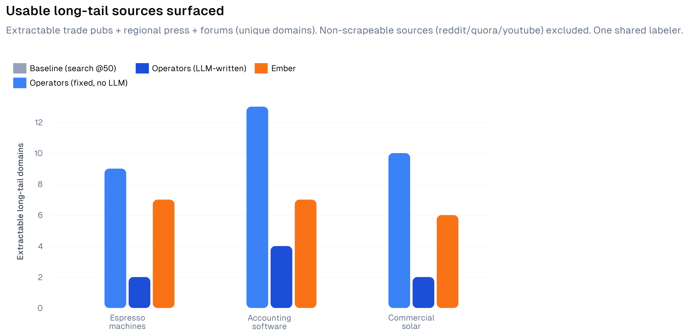
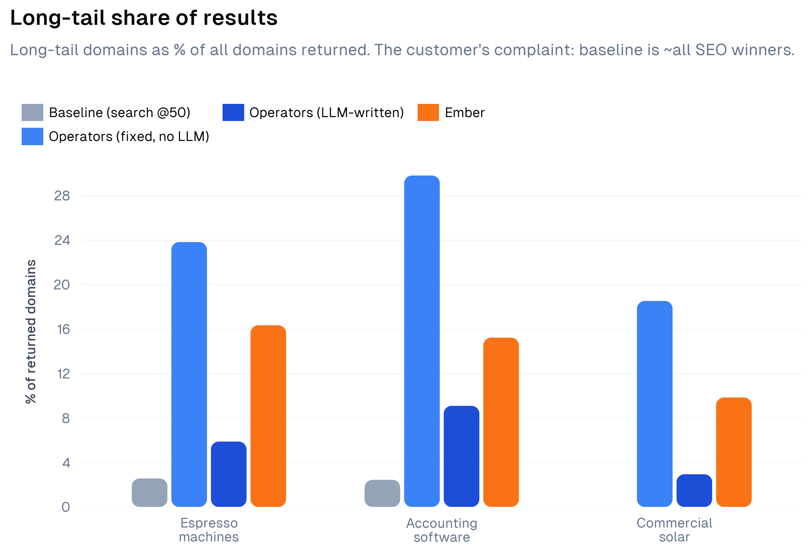
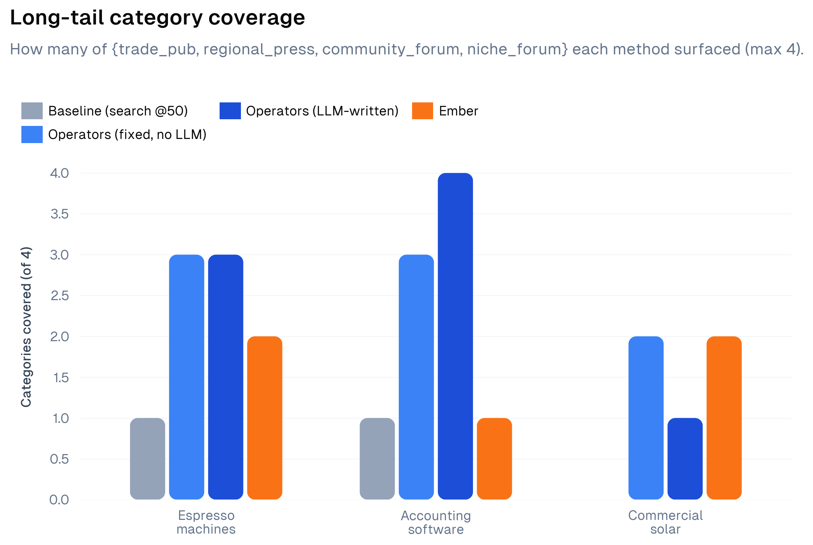

# Completeness eval — what actually surfaces the long tail

**Question.** Customer call #1: *"completeness is the product… going from ten to
fifty mostly gave us forty more of the same SEO winners. The sources we actually
miss don't show up at any limit."* What surfaces the **usable long tail** — trade
pubs, regional press, niche/community forums you can actually scrape and cite —
that the customer's analysts hand-find today?

Four methods, three topics, one shared ruler.

---

## The four methods

| Method | What it is | LLM? | Calls |
| --- | --- | :-: | :-: |
| **Baseline** | `/v2/search`, `limit: 50`, `web` — the customer's status quo (#1). | no | 1 |
| **Operators (fixed)** | A fixed recipe of *structural* operators, unioned: `intitle:forum`, `inurl:forum`, `magazine OR journal OR association`, + one pass excluding the top-6 SEO-winner domains. No hardcoded sites. | **no** | 5 |
| **Operators (LLM-written)** | Same operator *lever*, but the model writes the dork queries per topic. | yes | 1 + ~7 |
| **Ember** | Ember's `discoverAndClassify`: LLM query expansion → search → LLM entity extraction → search → dedupe. | yes | ~9 + ~50 |

**"Usable" = extractable.** Reddit/Quora/YouTube are surfaceable but not
scrapeable (they're in Ember's own `NON_EXTRACTABLE_DOMAINS`). A source you can't
scrape can't be cited in a report, so the headline metric counts **extractable**
long-tail domains only. (Total long-tail incl. non-extractable is reported too.)

---

## Result

Distinct **extractable** long-tail domains (one shared, method-agnostic labeler):

| Topic | Baseline | Ember | LLM-operators | **Operators (fixed)** |
| --- | :-: | :-: | :-: | :-: |
| Espresso machines | 0 | 3 | 2 | **9** |
| Accounting software | 0 | 0 | 4 | **13** |
| Commercial solar | 0 | 1 | 2 | **10** |
| **Total usable** | **0** | **4** | **8** | **32** |
| Total incl. non-extractable | 2 | 5 | 11 | 34 |

Three findings, in order of how much they surprised me.

### 1. A fixed, zero-LLM operator recipe wins by a mile — 32 usable vs. Ember's 4.

The structural operators (`intitle:forum`, `inurl:forum`, the trade-press keyword
probe, exclude-top-domains) found the real trade pubs the customer misses —
`sca.coffee`, `dailycoffeenews.com`, `accountingtoday.com`, `pv-magazine-usa.com`,
`solarpowerworldonline.com`, `seia.org` — none of which the baseline or Ember
surfaced. No LLM, no hardcoded sites, 5 calls.

### 2. LLM-written dorks were *worse* than the fixed recipe (8 vs. 32). Cleverness backfired.

Asked to generate operator queries, the model over-engineered them into
self-defeating shapes. Verbatim examples it produced:

- `"...accounting software" inurl:tradejournal OR inurl:industryreport -site:com -site:net`
  — **excludes `.com` and `.net`**, i.e. most of the web.
- `intitle:"...accounting software" AND forum OR discussion board -amazon -ebay -reddit`
  — **`-reddit`, and later `-forum`/`-blog`** on other queries: it excludes the very
  long-tail forums the task is trying to find.
- Six `AND` clauses stacked on one query — so over-constrained it returns almost
  nothing.

The LLM treats "use operators" as "use *more* operators," and each extra
constraint shrinks the result set. The fixed recipe wins precisely because it's
simple. **This is the direct answer to "won't the LLM do it better?" — measured,
no.** The operator *structure* is the lever; the LLM adds brittleness, not signal.

### 3. The baseline's "long tail" is a mirage — 0 usable.

Baseline surfaced 2 long-tail domains across all three topics, and **both were
non-extractable** (reddit). Zero usable sources. This is the customer's complaint
made literal: a plain `limit:50` search returns the SEO winners plus, at best, a
reddit thread you can't put in a report.

---

## Why not just pin `site:reddit.com`? (it was cut)

An earlier version of the fixed recipe included `site:reddit.com`. It was removed
for two reasons: (1) reddit is **non-extractable**, so it inflates the score with
sources you can't use; (2) hardcoding a specific site is **cherry-picking** that
doesn't generalize. Replacing it with the generic `inurl:forum` *improved* the
results (more real, extractable forums) — so the principled choice was also the
better one.

---

## What this means for Ember

1. **Recall is won with fixed structural operators — not an LLM, and not
   LLM-written operators.** Ember's LLM discovery (4 usable) and even LLM-written
   dorks (8) both lose badly to a 5-call fixed recipe (32). The LLM's failure mode
   is consistent: given freedom, it over-constrains (stacked `AND`/exclusions) or
   drifts (bare entity "Slayer" → the metal band, "Xero" → the vendor homepage).
2. **Point Ember's classifier at operator output.** The fixed operators do pull in
   some off-topic forums (`intitle:`/`inurl:forum` match any forum ranking for the
   terms). Filtering *that* — keep on-topic trade pubs, drop the triathlon forum —
   is exactly what Ember's source-type classifier is good at. The product the data
   points to: **fixed operator probes for recall → Ember's classifier for
   precision.** High recall *and* clean, and the LLM does the job it's actually
   good at (judging a source) instead of the ones it's bad at (guessing what to
   search, or writing operators).
3. **It's cheaper, too.** 5 search calls, no tokens, beats ~9 searches + ~50
   classify calls.

**Concrete next step:** add the fixed operator probe set as a discovery round in
`lib/completeness/discover.ts`, then let the existing classifier filter the union.
Drop the bare-entity probes (or anchor them with topic terms).

---

## Honest limitations

- **Small N.** 3 topics, one run each. Directionally strong, not a benchmark.
- **The shared labeler scores type, not on-topic relevance.** Operators' raw
  long-tail count includes some off-topic forums; that's the precision gap point 2
  is about. Applied identically to every method, so the comparison is fair.
- **Labeler is heuristic**, spot-checked, with a per-topic allowlist from an
  independent WebSearch oracle (see [AI-MISTAKE.md](AI-MISTAKE.md)).
- **The LLM-operator result is one prompt.** A better prompt might close some of
  the gap — but the failure mode (over-constraining) is systematic, and the point
  stands that "hand it to the LLM" is not automatically better.
- **Ember ran single-shot** (non-deterministic; ±1 between runs). The gaps here are
  far larger than that.

See [METHODOLOGY.md](METHODOLOGY.md) to reproduce.
